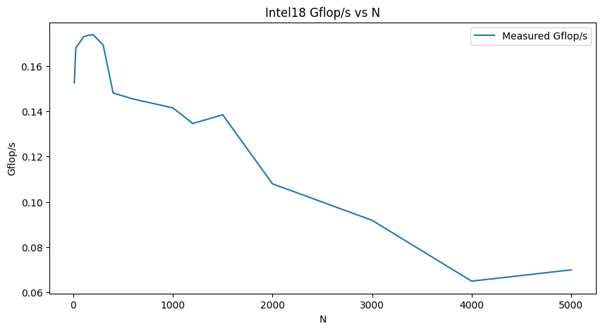
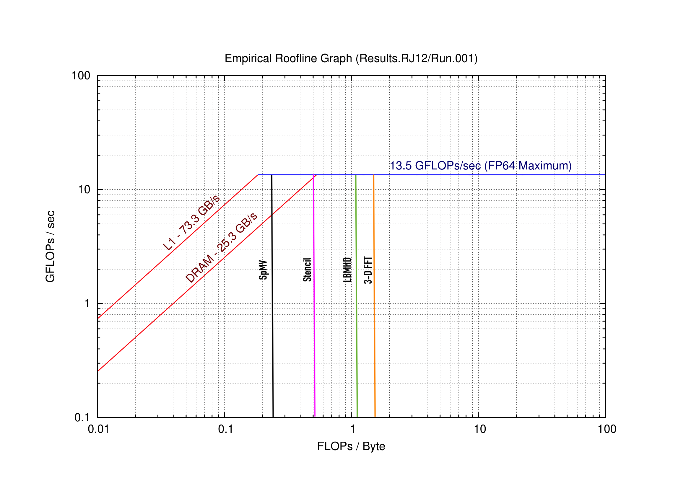

# Warm-up
1. `Y[j] += Y[j] + A[j][i] * B[i]`  
Memory Opertaion: 3   
FLOP: 4   

2. `s += A[i] * A[i]`   
Memory Opertaion: 2   
FLOP: 1   

3. `s += A[i] * B[i]`   
Memory Opertaion: 2   
FLOP: 2   

4. `Y[i] = A[i] + C*B[i]`   
Memory Opertaion: 2   
FLOP: 3   

# Part 1
1. see file part1.cpp   

2. `result[i][j] += matrix_one[i][k] * matrix_two[k][j];`   
Memory Opertaion: 2   
FLOP: 3    
Putting this line of code into a three nested loop with given matrix size N, and we get result, 2*N^3

3. `Mflop_s = (pow(num,3)*2) /average_time/ pow(10,6)`   
    Machine: Intel(R) Xeon(R) Gold 6148 CPU @ 2.40GHz (Intel18)       
    Average Time Computing: 0.0115497    
    Performance in Mflop/s(scientific format): 1.73e+02    
    Performance in Mflop/s: 173.16    
        
    AMD EPYC 7H12 64-Core Processor (AMD20)        
    Average Time Computing: 0.000941665    
    Performance in Mflop/s(scientific format): 2.12e+03    
    Performance in Mflop/s: 2123.90    

4. `Theoretical Peak = Clock Speed x No. of Floating Point Units x No. of Cores` 
    lscpu returns the information for entire cluster, but techinically we are only running on one CPU in the entire cluster.     
    Machine: Intel(R) Xeon(R) Gold 6148 CPU @ 2.40GHz (Intel18)   
    Clock Speed = 2.40GHz    
    No. of Floating Point Units = 1    
    No. of Cores = 40    
    Theoretical Peak (total) = 96 Gflop/s    
    Theoretical Peak (per core) = 2.4 Gflop/s      
    The measured performance is significantly lower than the theoretical peak performance.     
        
    AMD EPYC 7H12 64-Core Processor (AMD20)    
    Clock Speed = 2.595009GHz        
    No. of Floating Point Units = 1    
    No. of Cores = 128    
    Theoretical Peak = 332.161152 Gflop/s    
    Theoretical Peak (per core) = 2.60 Gflop/s      
    The measured performance is significantly lower than the theoretical peak performance.   

5.  

6.   
    Machine: Intel(R) Xeon(R) Gold 6148 CPU @ 2.40GHz (Intel18)   
    Architecture: x86_64      
    Clock Speed: 2.40GHz    
    No. of Cores: 40    
    Theoretical Peak: 96 Gflop/s  
    Theoretical Peak (per core) = 2.4 Gflop/s    
    Avg. Measured Speed (per core): 0.0946 Gflop/s      
    L1d cache: 32K     
    L1i cache: 32K    
    L2 cache: 1024K     
    L3 cache: 28160K     
        
    AMD EPYC 7H12 64-Core Processor (AMD20)    
    Architecture: x86_64      
    Clock Speed: 2.595009GHz         
    No. of Cores: 128    
    Theoretical Peak: 332.161152 Gflop/s    
    Theoretical Peak (per core) = 2.60 Gflop/s    
    Avg. Measured Speed (per core): 0.182 Gflop/s  
    L1d cache: 32K     
    L1i cache: 32K     
    L2 cache: 512K     
    L3 cache: 16384K     
    
    The Intel18 has 40 cores while AMD20 has 128 cores. A higher core means better parallel processing capabilities. AMD20 also has a higher clock speed which means faster processing speed for individual tasks. AMD20, hence has a higher theoretical peak performance than Intel18. The measured speed is measured using matrix multiplication running on a single core on the clusters.

    For N = 100, both architecture has significantly lower measured performance than theoretical peak performance. This is mainly due to the lack of parallelization in the matrix multiplication, and possibly power constraints set by HPCC. AMD20 also has slighly higer measured performance as compared to Intel18.

    The average measured performance for multiple N's compare to peak is also significantly lower, and also running out of memory for larger N's. Both architecutres has a peak performance at N in range (100, 900) and slowly decreasing as size of N gets larger.

# Part 2

1.
    N/A

2. 
    We ran the Empirical Roofline Model on 2 architectures on HPCC: intel 18 and amd 20. The empirical plots that we got are below:
    <figure>
        
        <figcaption>Intel 18</figcaption>
    </figure>

    <figure>
        
        <figcaption>AMD 20</figcaption>
    <figure>

3. 
    Peak performances, bandwidths, and ridgeline:

<<<<<<< HEAD
L1 Cache Ridgepoint =(12.3 GFLOPs/sec)/(56.4 GB/s)=0.218 FLOPs/byte

L2 Cache Ridgepoint =(12.3 GFLOPs/sec)/(37.4 GB/s)=0.328 FLOPs/byte

DRAM Cache Ridgepoint =(12.3 GFLOPs/sec)/(20.5 GB/s)=0.6 FLOPs/byte
=======
    The above Roofline plots illustrate the relationship between operational intensity and the performance of the computing architecture – GFLOPS/s / FLOPS/byte.  Value labels of each red line correspond to the maximum memory bandwidth available at cache levels L1, L2, and DRAM – this being the rate data can be read or written to memory from the CPU.  The different cache levels have a theoretical maximum memory bound bandwidth of 56.4, 37.4 and 20.5 GB/s for L1, L2 and DRAM, respectively. The peak theoretical performance for FP64 – the double-precision operations is 12.3 GLOPS/sec. Intersections of L1, L2, and DRAM and the horizontal peak performance line are the ridge-line points that highlight the moment when arithmetic/operational intensity is constrained by the machine’s computing ability, rather than its memory bandwidth.  Hence, by attempting to keep more of a task’s workload in the higher-level caches, like L1, we can approach the peak performance and, thus, efficiency for that machine.
    Arithmetic Intensity=  (Peak Performance (GFLOPs/sec))/(Bandwidth (GB/sec))
    Hence,
>>>>>>> faad8336ceaa5587df177ebf09d0b942d6501569

    L1 Cache Ridgepoint =(12.3 GFLOPs/sec)/(56.4 GB/s)=0.218 FLOPs/byte
    L2 Cache Ridgepoint =(12.3 GFLOPs/sec)/(37.4 GB/s)=0.328 FLOPs/byte
    DRAM Cache Ridgepoint =(12.3 GFLOPs/sec)/(20.5 GB/s)=0.6 FLOPs/byte

    These results indicate that workloads relying on lower parts of the memory hierarchy for data access must have a substantially larger arithmetic intensity before overcoming memory bandwidth limitations and approach peak computing performance. (Note – arithmetic intensity levels on x-axis prior to reaching the peak perf line are memory bound, rather than compute bound).

<<<<<<< HEAD
Based on the output of our Empirical Roofline model, we note that if the FLOPs/byte on the x-axis is in the range of L1 cache where its slope is increasing that we are memory bound -- prior to the ridge point. Alternatively, if the FLOPs/sec is in the range where we have reached our theoretical maximum, around 12.3 GFLOPs/sec, then we are in the terrority of being compute bound.  Based on the vertical markers of the plot for the four KP kernels, we can see we would be compute bound.  Some methods to improve efficiency if we are 'already at the high end of operational intensity' would involve methods to overcome the theoretical peak performance mark.  Some methods include instruction level parallelism, balancing floating-point operations, or unrolling the loops, as referenced in the text from Samuel Williams. 

5. Address the same questions in (4) for the four kernels given in the Warm-up above.

(be sure to address the fact that we’re assuming ‘’the high end of operational intensity’)

Among the four kernels in the warm-up, each have different characteristics regarding temporal and spatial locality, so the optimization methods might change for each. For example, the first kernel:

 Y[j] += Y[j] + A[j][i] * B[i] -- memory bound

We see that this likely has low temporal locality due to the two indices j and i, likely being memory constrained if computations become large.  Thus, j is the outer loop and it must complete all of the computations for one j before moving to the ith index.  To improve efficiency, SIMD, stencil, loop unrolling, or blocking – referenced in the paper, are methods that could improve a kernel like this one if we are assuming that we are already at the 'high end of operational intensity'.  Additionally, as referenced in the 3C's to operational intensity section, a method like padding arrays to reduce the traffic of from conflict misses increase memory constraints. By unrolling a loop like in this question, we could potentially improve the temporal locality by reducing the number of indices from 2 to 1, relying only on j.

  s += A[i] * A[i] -- compute bound
 
This kernel has high temporal and spatial locality. The same data is referenced twice and it uses the same index. If this kernel were to reach a bottleneck, it would be from computing. Similar methods as referenced in question 4 could be applied -- balancing floating point operations and instruction-level parallelism.  (-- THIS SHOULD BE CONFIRMED WITH REST OF GROUP -- need to elaborate on how instruction level parallelism and balancing floating point ops will make this faster).

The last two kernels, the same methods to overcome their constraints could be applied.

  s += A[i] * B[i] -- this is memory bound since we are before the ridge-point of the L1 cache.  

  Y[i] = A[i] + C*B[i] -- also memory bound

=======
4.
    From the table we can see the operational intensity of each of the kernels.
    Firstly, the SpMV has maximum operational intensity of 0.25, LBMHD: 1.07, Stencil: 0.5 and 3-D FFT: 1.64. If we plot the vertical lines corresponding to them on both roofline model plots we will get something like this (note: these plots are made by adding the vertical lines *by hand*).
>>>>>>> faad8336ceaa5587df177ebf09d0b942d6501569

    <figure>
        
        <figcaption>Intel 18</figcaption>
    </figure>

    <figure>
        
        <figcaption>AMD 20</figcaption>
    <figure>

    So for both amd 20 and intel 18, SpMV and Stencil would be bandwidth-bound and LBMHD and 3D-FFT would be compute-bound. To improve performance, based on the ERT paper, to reduce computational limits, we can improve ILP and apply SIMD, and/or balance floating-point operation mix. To reduce limits on bandwidth-bound kernels, we can restucture loops for unit size accesses and ensure memomry affinity. This conclusion is based on https://www2.eecs.berkeley.edu/Pubs/TechRpts/2008/EECS-2008-134.pdf.
5. 
    ???

6. 
    By comparing the results of the roofline model to those of the matrix-matrix multiplication in part 1, there are several noteworthy observations and explanations.  For example, we see that the L1 cache ridge-point is 0.218 and over the range of matrix size N, matrix-matrix multiplication peak around ≈0.18, which occurs when N is quite small - likely between 10 and 20.  When N is small, the entire matrices fit into the CPU’s cache (perhaps caches L1 and L2) and efficiency is at its peak because there are no memory access delays.  As N grows, there are clear points in the plot where the matrices no longer fit into the upper memory caches and cache misses begin to occur, thus showing decreases in GFLOPs/sec followed by plateaus.  When N gets very large and the upper levels caches become fully utilized, then requiring DRAM access, resulting in slower computational efficiency.  Eventually, we reach a point, around where N=2000, that DRAM is also being heavily utilized and the bottleneck becomes the memory bandwidth.

    To maximize the efficiency in computing matrix- matrix multiplication, making the cache size correspond closely to the row/column size of the matrix improves the spatial locality of the data within memory.  If the dimensions of the rows/columns fit within the first cache, for example, the number of cache misses will decrease – this is specifically relevant since much of the matrix rows/cols are reused in matrix-matrix multiplication.  The strategy to accomplish this, as the paper, Roofline: An Insightful Visual Performance Model for Floating-Point Programs and Multicore Architectures‘ mentions, is called blocking.  This strategy could improve the efficiency of matrix multiplication by making more efficient use of the CPU cache by dividing the matrices into smaller pieces that fit in the cache and thus do not need to be repeatedly accessed in lower levels of memory due to improved spatial and temporal locality.
